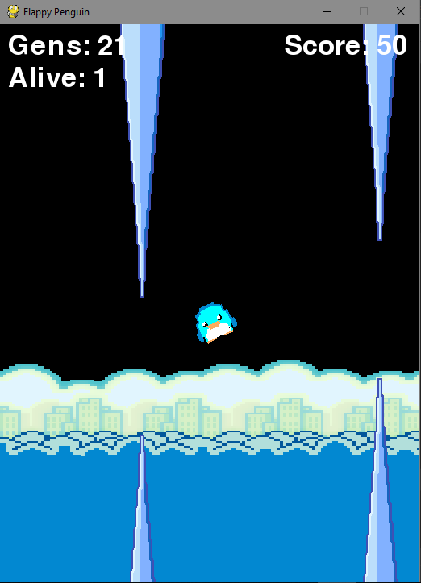

# Hoppin-Guin

This game shows how Artifiical Intelligence (AI) learn and train itself to play Hoppin-Guin (Flappy Bird version) using Neuro Evolution of Augmenting Topologies (NEAT). It is a method for evolving artificial neural networks with a genetic algorithm.
# System configuration
1. pip install pygame
2. pip install neat-python
